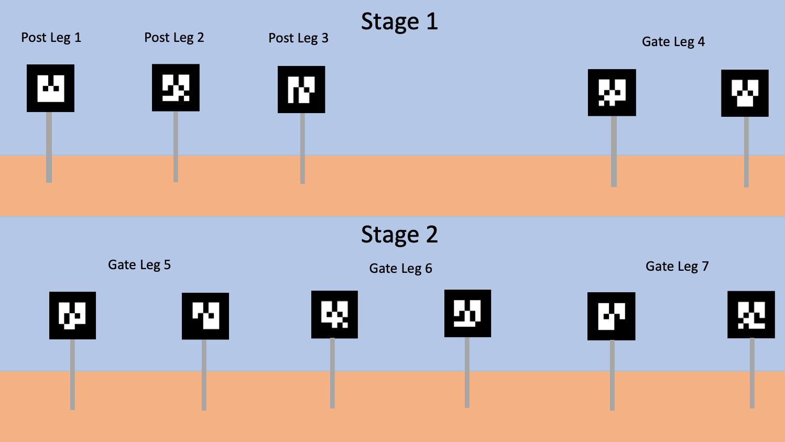

# Capstone Project
[Back to the README](README.md)

The purpose of this capstone project is to encapsulate the knowledge you have gained through participating in the ML track, while simultaneously tying this knowledge set back to the needs of the SJSU Robotics Team. In addition to the evaluation goals laid out in each project tier, our assessment goals generally are to determine

* your grasp of fundamental neural network concepts, 
* your ability to work with image data, and
* your familiarity with the PyTorch framework.

---

## Elaboration of SJSU Robotics Team Needs

The competition requirements and guidelines pertaining to autonomous navigation are listed in §3.e of [this PDF file](assets/University_Rover_Challenge_Rules_2020.pdf), and the addendum to these rules pertaining to autonomous navigation are listed [on this webpage](http://urc.marssociety.org/home/q-a#TOC-Autonomous-Traversal-Mission-Questions). Of particular interest are the posts and gates at the end of each navigation leg of the mission; these posts and gates are the focus of the vision processing task of this capstone project. An abstract depiction of these objects are shown below:

### Details

* Post: `30-100 cm` tall, topped by a three-sided triangular prism.
    * Each rectilinear side of the prism is `20 cm x 20 cm`
    * Each rectilinear side of the prism displays a black and white AR tag
* Gate: comprised of two posts
    * Posts are `2 m` or `3 m` apart

### Provided Resources

* [Image dataset](https://drive.google.com/drive/folders/1wUUMDKXkqzcwiIRr2j4JmGj8vT1KPrP5?usp=sharing), containing
   * posts
   * AR tags
   * humans
   * desert background
* [Image augmentation engine for dataset generation](../assets/imgaug_engine.py)
* [User guide for the image augmentation engine](https://docs.google.com/presentation/d/1hxJtgxXey60Fdq6rli5CVl9r8Mb0xHoQaVqNBnzHT5k/edit?usp=sharing)

---

## Elaboration of Project Tiers

To accommodate the diversity of skill levels in our summer program participants, we are providing two capstone project tiers. Please select one of the following tiers, based on your comfort level:

* If you feel you have just begun to grasp the concepts presented in this program, please proceed with the **Foundational** capstone project.
* If you feel confident with what you have learned through these past few weeks, you are encouraged to complete the **Advanced** capstone project.

---

### Foundational - Image Classification

In this project, you will leverage the neural network training fixture you developed in part five of [the PyTorch assignment](assignments/colab/2020/module2/PyTorch.ipynb) to construct an image classifier for posts and gates.

#### Requirements and Guidelines

* The input image dimension is scaled 2-to-1 w.r.t width and height.
    * Specifically, the input dimensions are `(64, 32, 3)`
* The expected image classes are `post`, `gate`, and `human`
    * **Going beyond**: Consider adding a `none` class
* Your neural network shall hold no more than 2.4 million parameters
    * This approximates the resource limitations on embedded platforms such as the NVIDIA Jetson TX2.

---

### Advanced - Object Detection and Instance Segmentation

In this project, you will train a neural network to perform instance segmentation on posts and gates. In particular, you will leverage concepts from the [TorchVision Object Detection Finetuning Tutorial](https://pytorch.org/tutorials/intermediate/torchvision_tutorial.html).

### Requirements and Guidelines

* The network must tolerate inputs of varying sizes
    * Maximum size is `1280 x 720` pixels
* The expected image classes are `post`, `gate`, `human`, and `none`
    * `none` should correspond to the image background
* The network output should be a pixel mask (i.e. segmentation) of any detected object instance
    * **Going beyond**: post-processing of the pixel mask should provide various information, including
        * `(x, y)` pixels to avoid, i.e. for collision avoidance with `human` judges or attendants
        * `(x, y)` pixel to target, i.e. as a navigation goal, the base of the `post` or the midpoint of the `gate`
